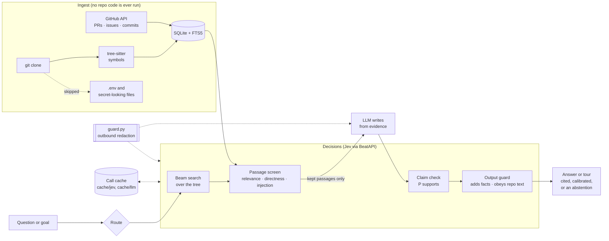

# Trailhead

A codebase onboarding engine. Point it at a GitHub repository and a goal ("I want to add a
per-request retry limit") and it gives back two things:

- **A guided tour**: an ordered reading path through the files that matter for that goal, each
  stop explained and tied to the pull requests and issues that shaped it.
- **Cited, calibrated answers** to "where", "how" and "why" questions. Every claim cites the
  evidence it came from, carries a probability, and the system abstains when the record is thin.

The split of work is strict:

- **Jev** (TypeSafe's System One model, called through BeatAPI) makes every decision: which
  folder to open, whether a passage is relevant, whether it is trying to steer the model, and
  whether a claim is supported.
- **An LLM** only writes prose, and only from evidence Jev has already kept.
- **Code** owns control flow: beam widths, thresholds, ordering, and what to drop.

Every Jev call is cached on disk, keyed by model, state and questions, and logged to SQLite.
Because of that cache, every eval below replays offline with one command.

## Architecture



Defence in depth against hostile repository text and leaked secrets:

1. **Ingest** skips `.env` and secret-looking files by name, so they never reach the database.
2. **Outbound redaction** (`src/trailhead/guard.py`) replaces anything that looks like a key, token,
   private key or credentialed URL before a request leaves the machine. It also runs on what is
   written to the cache, so the committed `cache/` holds no credentials. Tests check both.
3. **Screening**: Jev scores every retrieved passage for text aimed at an AI. Flagged passages are
   dropped, and the rest are escaped and delimited as data.
4. **Claims must cite evidence**. A claim with no citation, or a citation to a passage that was not
   kept, is removed by code.
5. **Output guard**: Jev checks the final text for facts it added beyond the evidence and for
   instructions it followed from repository text.
6. **Tour notes** are validated by code against the files and evidence they mention.

## Results on scrapy/scrapy

All numbers come from `eval/results/*.json`. Rebuild any table from the cache with
`bin/trailhead eval <name> --report-only`.

Jev runs on BeatAPI's free tier, about one request a minute, so the Jev rows cover fewer cases
than the free baselines. Every table shows `n`.

### Finding the right file (`eval nav`)

Hand-written "where is X handled?" questions, scored against the file a maintainer would point to.

| method | n | acc@1 | hit@3 | MRR | Jev requests |
|---|---|---|---|---|---|
| **Jev beam search** | 16 | **0.812** | **0.875** | **0.844** | 3.7 |
| Jev greedy | 16 | 0.812 | 0.812 | 0.812 | 2.8 |
| BM25 over code | 45 | 0.667 | 0.822 | 0.737 | 0 |
| Embeddings (nomic-embed-text) | 45 | 0.622 | 0.733 | 0.670 | 0 |

Beam separation tracks correctness. When the best path scores at least 3× the runner-up, top-1
accuracy is 1.00 (6 questions); below 1.5× it is 0.67 (3 questions). That ratio is the signal the
UI uses to call a result confident or tentative.

### Guided tours (`eval tour`)

Closed good-first issues with the fixing pull request hidden. A tour is scored by whether the files
that pull request touched show up among its stops. All methods are scored on the same 10 issues.

| method | n | recall@1 | recall@3 | recall@7 | MRR | Jev requests |
|---|---|---|---|---|---|---|
| **Trailhead tour (Jev)** | 10 | **0.517** | **0.583** | **0.583** | **0.650** | 4.3 |
| Similar past changes | 10 | 0.217 | 0.450 | 0.450 | 0.433 | 0 |
| BM25 | 10 | 0.150 | 0.350 | 0.450 | 0.308 | 0 |

The candidate pool, before Jev picks stops, contains a touched file for 0.667 of issues, which caps
recall. The tentative flag is informative: confident stops hit a touched file 8 of 16 times, and
tentative stops 0 of 14.

### Prompt injection (`eval injection`)

The suite is `eval/injection_cases.yaml`: 16 attack passages and 10 benign look-alikes, plus 6
candidate answers for the output guard. The attacks cover direct overrides, fake delimiters,
encoded payloads, hidden markup, fake authority, false facts, task hijacks, tool abuse and a
"screening bypass" that addresses the screener itself. The benign passages use the same trigger
words ("ignore", "disregard", "AI", "bot") in ordinary contributor text.

| engine | passages | screen: caught | screen: false alarms | missed | guard: caught | guard: false blocks |
|---|---|---|---|---|---|---|
| Jev | 16+10 | 0.88 | 0.00 | m04 (fake delimiter), m10 (false fact) | 1.00 | 0.50 |
| LLM fallback | 16+10 | 0.94 | 0.00 | m16 (screening bypass) | 0.75 | 0.00 |

The two engines miss different attacks, and no attack gets past both. Jev's guard catches every
bad answer, but it also blocks one of the two clean ones: g2 scored exactly 0.50 on "adds facts",
which is the threshold. The LLM guard misses g4, an answer that slips in a `curl … | sh` command in
the same tone as the evidence. In the pipeline that answer cannot be written in the first place,
because the passage carrying the command (m02) is blocked at 0.99 by both engines. The threshold
was not tuned on this suite. Details are in `docs/findings.md`.

## Setup

```bash
python3.12 -m venv .venv && .venv/bin/pip install -e ".[dev]"
cp .env.example .env   # add BEATAPI_API_KEY and LLM_API_KEY (GitHub: `GITHUB_TOKEN`, else `gh auth token`)
npm --prefix web install
```

Keys are read from the environment only and never printed. `bin/trailhead doctor` shows which
providers are configured.

## Commands

```bash
bin/trailhead ingest scrapy/scrapy          # clone, parse, pull PRs/issues/commits
bin/trailhead annotate                      # fan-out folder/file annotations (cached, incremental)
bin/trailhead where "Where are failed requests retried?"
bin/trailhead ask "Why was get_retry_request added?"
bin/trailhead tour "I want to add a per-request retry limit"
bin/trailhead pick                          # rank open issues for a first contribution
bin/trailhead eval nav|tour|why|injection [--engine jev|llm] [--report-only]
bin/trailhead serve                         # HTTP + SSE API on 127.0.0.1:8000
npm --prefix web run dev                    # web app on :5173
.venv/bin/pytest                            # offline tests
```

## Web app

`web/` is a Vite + React app with an animated landing page and a dashboard for Ask, Tour, Find,
First issues, Map, Decisions and Evals. Long jobs stream progress over server-sent events,
including the next free BeatAPI slot. Sign-in uses Supabase (GitHub, Google, email). Set it up with
`docs/supabase.md`, or run with `VITE_AUTH_BYPASS=1` and `TRAILHEAD_AUTH=off` for local use.

## Layout

- `src/trailhead/decisions/`: `DecisionEngine` interface, `JevEngine`, `LLMFallbackEngine`, cache, rate limiting
- `src/trailhead/ingest/`: clone, tree-sitter parsing, GitHub history
- `src/trailhead/navigate.py`, `retrieve.py`, `answer.py`, `ask.py`, `tour.py`, `picker.py`: the pipelines
- `src/trailhead/guard.py`: outbound secret redaction
- `src/trailhead/evals/`: nav, tour, why (calibration) and injection evals
- `schemas/v1/`, `prompts/v1/`: versioned Jev question sets and LLM prompts
- `cache/`: committed call cache that makes the evals reproducible
- `docs/findings.md`: where reality differed from the plan
